# Discrete 3.3 V Linear Regulator


<!-- Adjust width/height as needed -->
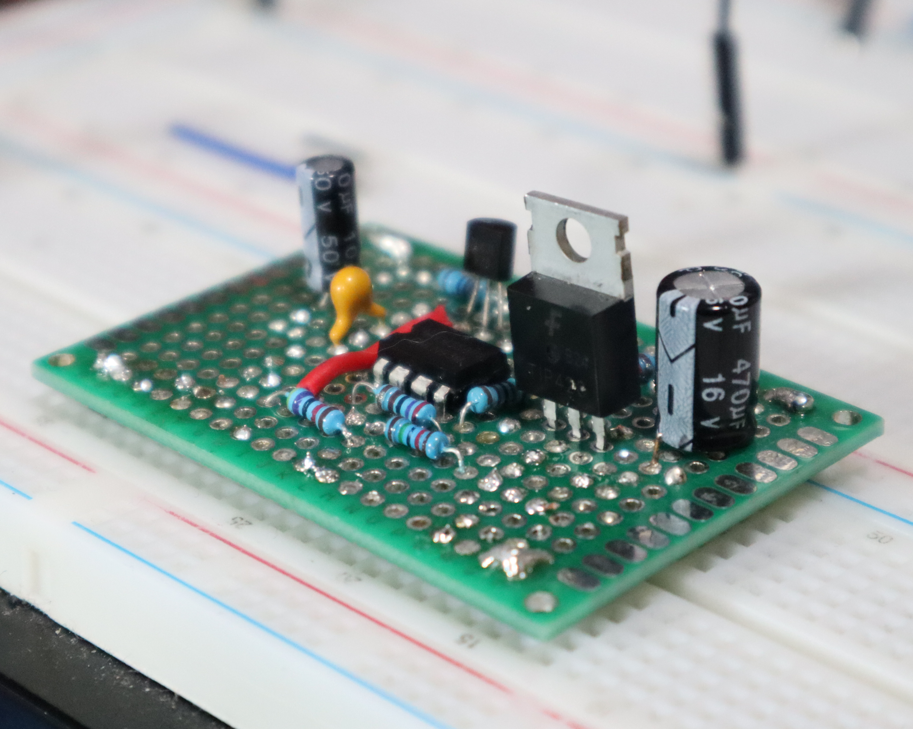
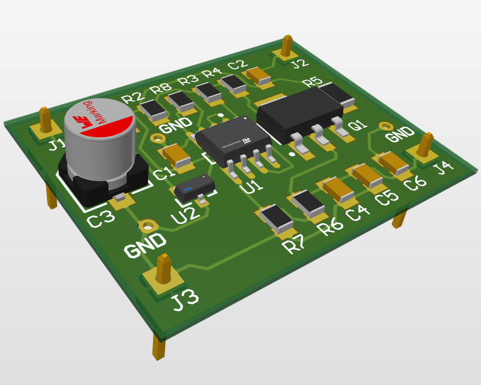


## Overview

- **Objective**: Designing a Discrete 3.3 V Linear Regulator circuit to provide a stable output voltage with low dropout and minimal noise with able to support changes in the output load current with minimal variation in output voltage.

---

## Component(s) Used

| Component              | Part Number | Package | Datasheet                                                           | Manufacturer      |
|------------------------|-------------|---------|---------------------------------------------------------------------|-------------------|
| BJT (PNP)              | TIP42C      | TO-220  | [Link](https://www.onsemi.com/download/data-sheet/pdf/tip42c-d.pdf) | ON Semiconductor  |
| Programmable Reference | TL431A928   | TO-92   | [TL431 Datasheet](https://www.ti.com/lit/ds/symlink/tl431.pdf)      | Texas Instruments |
| Operational Amplifier  | LM358       | SOIC-8  | [LM358 Datasheet](https://www.ti.com/lit/ds/symlink/lm358.pdf)      | Texas Instruments |

## Circuit Configuration

- **$V_{supply}$**: Specified DC supply voltage
- **$R_{ref}$**: Reference resistor to set feedback target voltage
- **$R_{base}$**: Base resistor for the PNP transistor
- **$R_{pull}$**: Pull-up resistor for the output
- **$R_{sense}$**: Sense resistor to monitor output current
- **$R_{F1}$, $R_{F2}$**: Feedback resistors to set feedback voltage divider
- **$C_{out}$**: Output capacitor for stability and noise reduction
- **$I_{load}$**: Load current drawn from the output

**Key Connections**:

- **$V_{supply}$** to the TL431 cathode through **$R_{ref}$**
- TL431 Cathode shorted to Ref, connected to the inverting input of LM358
- TL431 anode to ground
- LM358 output to TIP42C base through **$R_{base}$**
- TIP42C Base to **$V_{supply}$** through **$R_{pull}$**
- TIP42C Emitter to **$V_{supply}$** through **$R_{sense}$**
- TIP42C Collector to **$I_{load}$**, **$C_{out}$**, and feedback network (**$R_{F1}$**, **$R_{F2}$**)
- **$R_{F1}$** and **$R_{F2}$** form a voltage divider from the output to the non-inverting input of LM358
- LM358 non-inverting input connected to the junction of **$R_{F1}$** and **$R_{F2}$**
- **$R_{F2}$**, **$C_{Out}$**, and **$I_{Load}$** connected to ground


---

## Test Objectives

### Primary Goal:

- Provide output voltage of 3.3V ±5% under target load current of 12 mA with spikes of up to 120 mA.
- Maintain stable output voltage with minimal variation during load transients.

### Secondary Checks:

- Verify dropout voltage under varying load conditions.
- Assess noise performance at the output under load.


## LTspice Simulation:

### Design Considerations

- The transient load response is dominated by output capacitance and pass-device behavior, with the control loop providing correction rather than relying on aggressive op-amp drive current. This contributes to minimal voltage droop during burst loading.
- Burst loading was implemented using a resistive load and fully enhanced NMOS switch, ensuring fast and repeatable load steps without introducing inductive effects that could obscure regulator behavior.
- The selected burst profile (20 Hz, 10% duty, 5 ms ON) intentionally exceeds typical operating conditions to provide margin while remaining within realistic system-level load dynamics.
- Recovery time and stability were maintained even when loop response was intentionally slowed in simulation, indicating adequate phase margin and robustness to component variation.
- Input voltage margin testing confirms regulation and transient behavior are preserved across expected upstream supply variation without entering dropout-limited operation.
- The design prioritizes predictable transient behavior and stability over aggressive regulation bandwidth, resulting in clean recovery and absence of sustained ringing.

### Simulation Setup

**Circuit Parameters**:

- Input(s):
  - **$V_{supply}$**: 5 V
  - **$I_{load}$**: 12 mA
- Component values:
  - **$R_{ref}$**: 1.6k Ω
  - **$R_{base}$**: 2.7k Ω
  - **$R_{sense}$**: 0.22 Ω
  - **$R_{F1}$**: 10k Ω
  - **$R_{F2}$**: 30.1k Ω
  - **$C_{out}$**: 300 µF
- Analysis type:
  - .op | .tran | .step
- Sweep/Corners:
  - Sweep parameters provided as needed for custom loads or conditions
- Measurement points:
  - Output voltage (Vout)
  - Load current (Iload)
  - Dropout voltage
  - Noise at output
- Other relevant parameters:
  - Base current
  - Emitter current
  - Collector current
  - Power dissipation

### SPICE Directives


[Regulator Spice Directive](LTSpice/Directives/3V3_Linear_Regulator_Spice_Directive.md)


### Target Measurements

#### Steady-State Outputs

```spice
vout: V(collector)=3.35280060768
vdropout: V(emitter)-V(collector)=1.64451861382
vref: V(OpAmp_neg)=2.49622440338
i_ref_ma: Ix(U2:K)*m=1.56493869144
i_bjt_base_ua: -Ib(Q1)*u=102.271638752
i_bjt_emitter_ma: Ie(Q1)*m=12.1858743951
i_bjt_collector_ma: -Ic(Q1)*m=12.0836030692
beta_bjt: Ic(Q1)/Ib(Q1)=118.152043094
```

**Voltages:**

| Parameter                   | Target  | Simulated | Notes |
|-----------------------------|---------|-----------|-------|
| $V_{collector}$ ($V_{out}$) | 3.3 V   | 3.35 V    |       |
| Dropout Voltage             | <2 V    | 1.64 V    |       |
| $V_{TL431\_ref}$            | 2.495 V | 2.496 V   |       |

**Currents:**

| Parameter            | Target   | Simulated | Notes |
|----------------------|----------|-----------|-------|
| $I_{load}$           | 12mA     | 12 mA     | Fixed |
| $I_{TL431}$          | ~1.565mA | 1.565 mA  |       |
| $I_{BJT\_base}$      | <1mA     | 0.102 mA  |       |
| $I_{BJT\_emitter}$   | ~12mA    | 12.186 mA |       |
| $I_{BJT\_collector}$ | ~12mA    | 12.084 mA |       |

## Benchtop Test

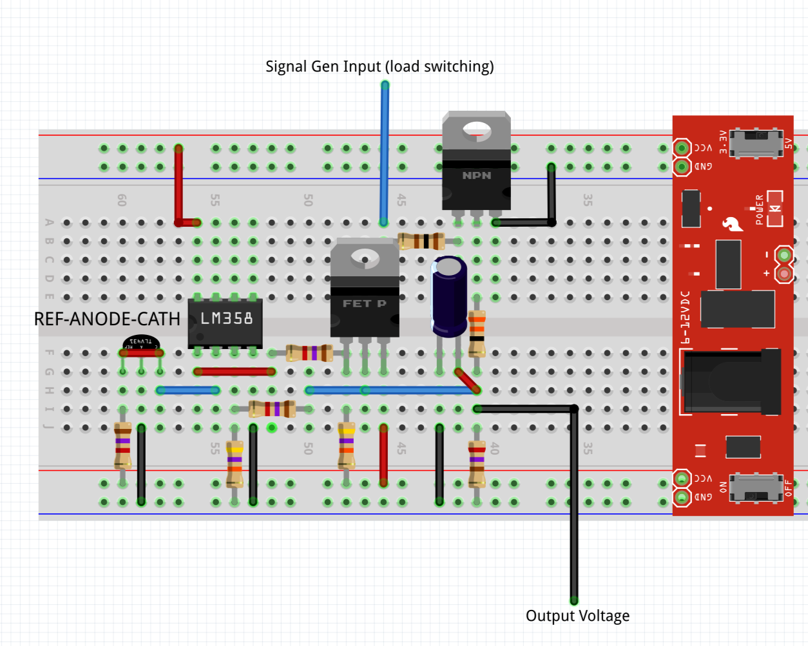
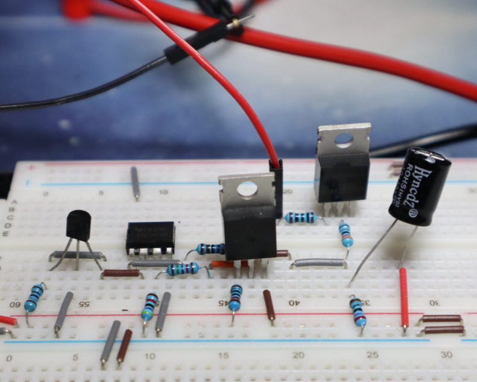


**Equipment**

| Equipment          | Model   | Description                                      | Manufacturer | Notes                                     |
|--------------------|---------|--------------------------------------------------|--------------|-------------------------------------------|
| Bench Power Supply | 853D    | Adjustable DC power supply with multiple outputs | Yihua        | Used for powering circuits during testing |
| Function Generator | DG1022Z | Dual-channel 20 MHz waveform generator           | Rigol        | Simulates input signals for test circuits |
| Oscilloscope       | DS1054Z | 4-channel, 50 MHz digital oscilloscope           | Rigol        | Core tool for time-domain signal analysis |
| Digital Multimeter | MM450   | Handheld multimeter for measuring V, I, and R    | Klein Tools  | General-purpose measurements              |

**Components Used**

| Component              | Part Number | Package      | Datasheet                                                                                                                                                 | Manufacturer      | Notes                                                        |
|------------------------|-------------|--------------|-----------------------------------------------------------------------------------------------------------------------------------------------------------|-------------------|--------------------------------------------------------------|
| BJT (PNP)              | TIP42C      | TO-220       | [TIP42C Datasheet](https://www.onsemi.com/download/data-sheet/pdf/tip42c-d.pdf)                                                                           | ON Semiconductor  |                                                              |
| Programmable Reference | TL431A928   | TO-92        | [TL431 Datasheet](https://www.ti.com/lit/ds/symlink/tl431.pdf)                                                                                            | Texas Instruments |                                                              |
| Operational Amplifier  | LM358       | SOIC-8       | [LM358 Datasheet](https://www.ti.com/lit/ds/symlink/lm358.pdf)                                                                                            | Texas Instruments |                                                              |
| MOSFET                 | IRF540N     | TO-220       | [IRF540N Datasheet](https://www.infineon.com/assets/row/public/documents/24/49/infineon-irf540n-datasheet-en.pdf?fileId=5546d462533600a4015355e39f0d19a1) | Infineon          | Load Switching                                               |
| $R_{ref}$              | 1.8k Ω      | Through-Hole | Generic                                                                                                                                                   |                   |                                                              |
| $R_{base}$             | 2.7k Ω      | Through-Hole | Generic                                                                                                                                                   |                   |                                                              |
| $R_{Pull-up,Base}$     | 10k Ω       | Through-Hole | Generic                                                                                                                                                   |                   |                                                              |
| $R_{sense}$            | -           | -            | -                                                                                                                                                         |                   | Omitted for breadboard                                       |
| $R_{F1}$               | 15k Ω       | Through-Hole | Generic                                                                                                                                                   |                   | Available                                                    |
| $R_{F2}$               | 47k Ω       | Through-Hole | Generic                                                                                                                                                   |                   | Available                                                    |
| $C_{out}$              | 330 µF      | Through-Hole | Generic                                                                                                                                                   |                   | Available                                                    |
| $R_{B1}$               | 100 Ω       | Through-Hole | Generic                                                                                                                                                   |                   | Base Resistor for Switching MOSFET                           |
| $R_{B2}$               | 10k Ω       | Through-Hole | Generic                                                                                                                                                   |                   | Pull-up Resistor for Switching MOSFET Base                   |
| $R_{L1}$               | 270 Ω       | Through-Hole | Generic                                                                                                                                                   |                   | Load Emulation - Connected from output to ground             |
| $R_{L2}$               | 33 Ω        | Through-Hole | Generic                                                                                                                                                   |                   | Load Emulation - connected to output and switched via MOSFET |

---

### Test 1 - DC Regulation

**Purpose**

- Verify the regulates near 3.3V under nominal load (~12 mA).
- Characterize DC output droop under a sustained high-load condition (~120 mA) and confirm Vout remains within an operational range suitable for downstream loads (e.g., RF modules).

**Procedure**

- Verify all wiring, resistor values, and polarity with power OFF.
- Set bench power supply to nominal Vin (do not enable output yet).
- Connect baseline load (270 Ω) to the regulator output.
- Power ON the circuit and observe for abnormal behavior (smell, heat, voltage jump).
- Allow 30 seconds for stabilization.
- Measure and record:
  - Output voltage (Vout) using a DMM
  - Output current (Iout) using DMM in series or calculated from Vout and load resistance
- Enable heavy load condition (270 Ω ∥ 33 Ω, steady ON).
- Allow 30 seconds for stabilization.
- Measure and record:
  - Output voltage (Vout)
  - Output current (Iout)
- Maintain heavy load for 5 minutes and observe Vout for drift or instability.
- Power OFF the circuit after measurements are complete.

**Acceptance Criteria**

- Nominal load (~12 mA): Vout within 3.135 V to 3.465 V.
- High load (~100 mA DC): Vout ≥ 2.7 V (operational floor), and no signs of instability or thermal runaway during a 5-minute hold.

**Notes**

- Ensure all connections are secure before powering the circuit.
- Use the digital multimeter to measure the output voltage accurately.
- Monitor the output voltage over a period of time to check for stability.
- Heavy-load current was limited to ~100 mA due to series resistance of the MOSFET switch and wiring

**Measured Results**

| Metric                   | Target | Limit                     | Measured | Result | Notes                                                                    |
|--------------------------|--------|---------------------------|----------|--------|--------------------------------------------------------------------------|
| Load Current 1           | 12 mA  | —                         | 12.07 mA | Pass   |                                                                          |
| Load Current 2           | 100 mA | —                         | 83.8 mA  | Pass   | Limited by series resistance of MOSFET switch and resistor power ratings |
| Output Voltage (12 mA)   | 3.3 V  | 3.135 V - 3.465 V         | 3.269 V  | Pass   |                                                                          |
| Output Voltage (~100 mA) | —      | Vout ≥ 2.7 V (case-study) | 3.2 V    | Pass   | Output voltage stayed about minimum requirement for 2.7 V at 83.8 mA     |

**Design Considerations**

- The regulator maintained regulation within specified limits under nominal load conditions.
- Under high load, the output voltage dropped but remained above the operational threshold, indicating adequate headroom for downstream components.
- Output Capacitor value and characteristics should be optimized further to improve transient response under sudden load changes.

---

### Test 2 - Load-Step Transient (Bursts)

For the transient load step response, the resistor values for the load were adjusted such that we could test the regulator under more aggressive load steps. Component changes are as follows:

| Component | Value | Package      | Datasheet | Manufacturer | Notes                                                                 |
|-----------|-------|--------------|-----------|--------------|-----------------------------------------------------------------------|
| $R_{L1}$  | 68 Ω  | Through-Hole | Generic   |              | Increased load current draw (Worst case quiescent current of ~50 mA)  |
| $R_{L2}$  | 22 Ω  | Through-Hole | Generic   |              | Increased load current draw (Worst case quiescent current of ~130 mA) |

**Purpose**

- Validate regulator transient response to fast load-step bursts representative of radio TX events and/or worst-case dynamic loading.
- Confirm minimum $V_{OUT}$ droop stays above 90% of nominal during load bursts.
- Characterize recovery behavior (return to regulation band) and check for instability during repeated bursts.

**Pulse Definition (Burst Profile)**

Gate drive applied to NMOS load switch controlling $R_{L2}$:

- Frequency: **20 Hz** (Period = 50 ms)
- Duty cycle: **10%**
- Burst ON-time ($T_{ON}$): **5 ms**
- Burst OFF-time ($T_{OFF}$): **45 ms**
- Gate amplitude: 5 V (sufficient to fully enhance NMOS)

**Procedure**

- Verify all wiring, resistor values, and polarity with power OFF.
- Set bench power supply to nominal Vin (do not enable output yet).
- Connect baseline load ($R_{L1}=68\,\Omega$) to the regulator output.
- Configure scope:
  - CH1: $V_{OUT}$ (DC coupling, bandwidth limit optional)
  - CH2: Gate drive to NMOS (burst control signal)
  - Trigger: CH2 rising edge (or $V_{OUT}$ falling edge)
- Power ON the circuit and observe for abnormal behavior (smell, heat, voltage jump).
- Enable burst load by applying the gate pulse to switch $R_{L2}$ in parallel for the defined burst profile.
- Capture waveforms for:
  - Single burst (zoomed) to measure droop and recovery
  - Multiple cycles to observe repeatability and any accumulating oscillation
- Record:
  - $V_{OUT,MIN}$ during burst
  - $V_{OUT,MAX}$ overshoot after burst removal
  - Settling time back to within {{1% or X mV}} of nominal
  - Any sustained ringing/oscillation

**Acceptance Criteria**

Definitions:

- $V_{OUT,NOM}$ = steady-state output voltage under baseline load prior to burst
- Regulation band = ±1% of $V_{OUT,NOM}$
- Project-defined minimum operating voltage threshold: **$V_{OUT,MIN\_OP} = 3.00\ \text{V}$ (Limit), 3.15 V (Target)**

Criteria:

- **Minimum output voltage during burst:**Target: $V_{OUT,MIN} \ge 3.15\ \text{V}$Limit:  $V_{OUT,MIN} \ge 3.00\ \text{V}$
- **Recovery:**Following burst removal (NMOS gate falling edge), $V_{OUT}$ shall return to and remain within ±1% of $V_{OUT,NOM}$within **2 ms** (Limit), target **1 ms**.
- **Stability:**No sustained oscillation observed during or following the burst.
- **Stability:**
  No sustained oscillation observed during or following the burst.

**Notes**

- Total output current was measured for baseline and burst states; branch currents were not measured directly.
- Derived burst-added current is calculated as $\Delta I_{BURST} = I_{TOTAL} - I_{BASE}$ for reference only.
- Due to the short duration of the burst load relative to DMM integration time, transient load current was not measured directly. Because the burst load is resistive and the NMOS is fully enhanced, the transient current during the burst is assumed equal to the steady-state current under the same load condition.

**Measured Results**

| Metric                                           | Target                    | Limit       | Measured | Result |
|--------------------------------------------------|---------------------------|-------------|----------|--------|
| Baseline load current ($I_{BASE}$)               | ~48.5 mA                  | 40–60 mA    | 45.1 mA  | Pass   |
| Total current during burst ($I_{TOTAL}$)         | ≥130 mA (meaningful step) | ≥120 mA     | 137.2 mA | Pass   |
| Derived added burst current ($\Delta I_{BURST}$) | ~90 mA (derived)          | — (derived) | 92.1 mA  | Info   |
| $V_{OUT,MIN}$ during burst                       | ≥3.15 V                   | ≥3.00 V     | 3.15 V   | Pass   |
| $V_{OUT,MAX}$ after burst                        | —                         | —           | 3.27 V   | Info   |
| Recovery time to ±1%                             | ≤1.0 ms                   | ≤2.0 ms     | <0.5 ms  | Pass   |


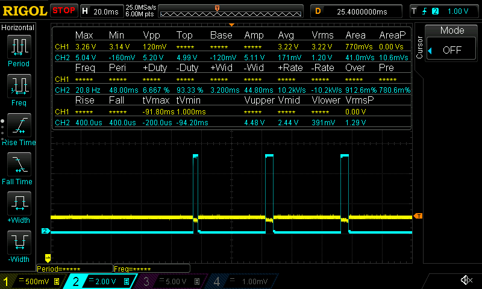
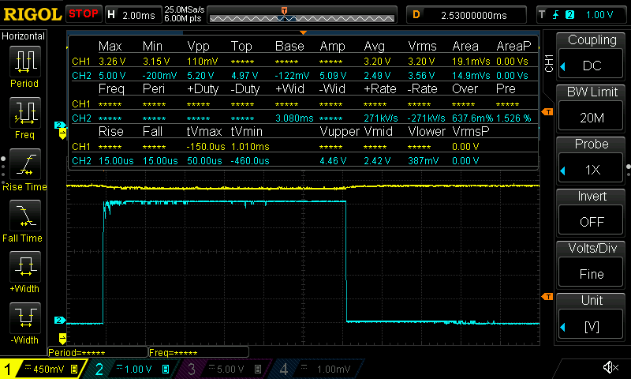

**Design Considerations**

- Burst profile (20 Hz, 10% duty) intentionally stresses the control loop with repeated load steps; confirm stability under worst-case capacitor tolerance and realistic ESR/ESL.
- If measured $I_{TOTAL}$ significantly differs from calculated values, verify resistor tolerances and NMOS $R_{DS(ON)}$ / gate drive amplitude.

---

### Test 3 - $V_{in}$ Margin

Test 2 is repeated at the minimum and maximum expected input voltage levels to evaluate transient response robustness across input variation.

For this test, the bench power supply is set to:

- $V_{in,MIN}$ = **4.75 V**
- $V_{in,MAX}$ = **5.25 V**

Which represent ±5% variation from nominal 5.0 V supply.

**Acceptance Criteria**

- All criteria from Test 2 must be met at both $V_{in,MIN}$ and $V_{in,MAX}$ conditions.

**Notes**

- LM358 high-side output swing is limited; this regulator is not intended for complete shutdown without additional circuitry.
- Due to the short duration of the burst load relative to DMM integration time, transient load current was not measured directly. Because the burst load is resistive and the NMOS is fully enhanced, the transient current during the burst is assumed equal to the steady-state current under the same load condition.

**Measured Results - $V_{in,MIN}$**

| Metric                                                | Target                    | Limit       | Measured  | Result |
|-------------------------------------------------------|---------------------------|-------------|-----------|--------|
| Baseline load current <br> ($I_{BASE}$)               | ~48.5 mA                  | 40–60 mA    | 45.1 mA   | pass   |
| Total current during burst <br> ($I_{TOTAL}$)         | ≥130 mA (meaningful step) | ≥120 mA     | 137.2 mA  | pass   |
| Derived added burst current <br> ($\Delta I_{BURST}$) | ~90 mA (derived)          | — (derived) | 92.1 mA   | info   |
| $V_{OUT,MIN}$ during burst                            | ≥3.15 V                   | ≥3.00 V     | 3.17 V    | pass   |
| $V_{OUT,MAX}$ after burst                             | —                         | —           | 3.28 V    | pass   |
| Recovery time to ±1%                                  | ≤1.0 ms                   | ≤2.0 ms     | << 1.0 ms | pass   |


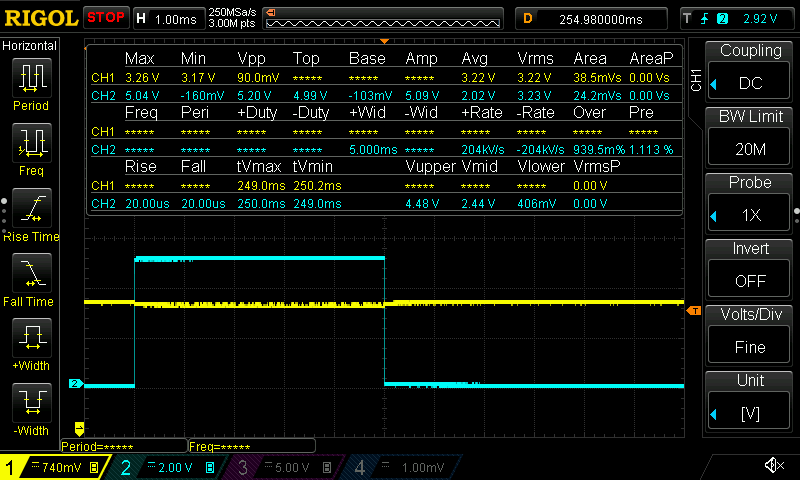

**Measured Results - $V_{in,MAX}$**

| Metric                                           | Target                    | Limit       | Measured  | Result |
|--------------------------------------------------|---------------------------|-------------|-----------|--------|
| Baseline load current ($I_{BASE}$)               | ~48.5 mA                  | 40–60 mA    | 44.1 mA   | pass   |
| Total current during burst ($I_{TOTAL}$)         | ≥130 mA (meaningful step) | ≥120 mA     | 137.2 mA  | pass   |
| Derived added burst current ($\Delta I_{BURST}$) | ~90 mA (derived)          | — (derived) | 93.1 mA   | info   |
| $V_{OUT,MIN}$ during burst                       | ≥3.15 V                   | ≥3.00 V     | 3.17 V    | pass   |
| $V_{OUT,MAX}$ after burst                        | —                         | —           | 3.23 V    | pass   |
| Recovery time to ±1%                             | ≤1.0 ms                   | ≤2.0 ms     | << 1.0 ms | pass   |

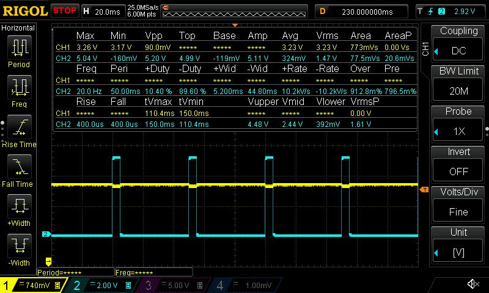

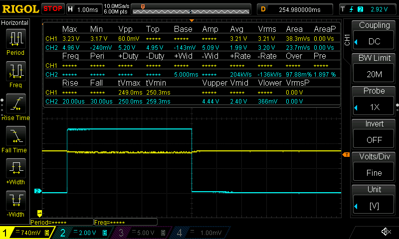

---

## Design Considerations

- The transient load response is dominated by output capacitance and pass-device behavior, with the control loop providing correction rather than relying on aggressive op-amp drive current. This contributes to minimal voltage droop during burst loading.
- Burst loading was implemented using a resistive load and fully enhanced NMOS switch, ensuring fast and repeatable load steps without introducing inductive effects that could obscure regulator behavior.
- The selected burst profile (20 Hz, 10% duty, 5 ms ON) intentionally exceeds typical operating conditions to provide margin while remaining within realistic system-level load dynamics.
- Recovery time and stability were maintained even when loop response was intentionally slowed in simulation, indicating adequate phase margin and robustness to component variation.
- The design prioritizes predictable transient behavior and stability over aggressive regulation bandwidth, resulting in clean recovery and absence of sustained ringing.

---

## Hardware Implementations

### Soldered Protoboard (Tested)


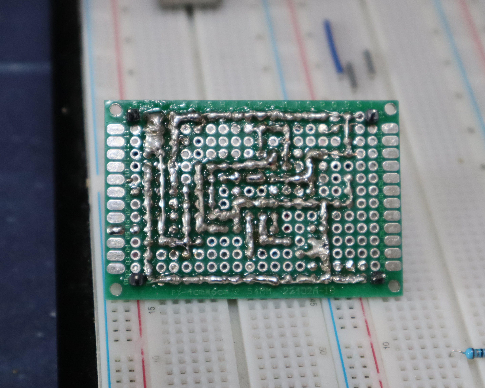

### Custom PCB (Designed)


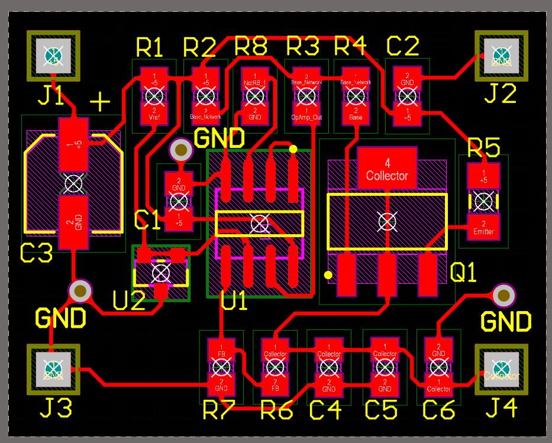
