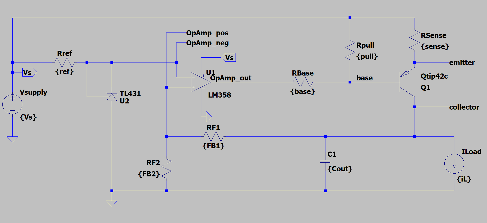

# LDO Regulator

## Overview
- **Objective**: Designing an LDO circuit to provide a stable output voltage with low dropout and minimal noise with able to support changes in the output load current with minimal variation in output voltage.

---

## Component(s) Used
| Component                  | Part Number | Package | Datasheet                                                           | Manufacturer      |
|----------------------------|-------------|---------|---------------------------------------------------------------------|-------------------|
| BJT (PNP)                  | TIP42C      | TO-220  | [Link](https://www.onsemi.com/download/data-sheet/pdf/tip42c-d.pdf) | ON Semiconductor  |
| Programmable Reference     | TL431A928   | TO-92   | [TL431 Datasheet](https://www.ti.com/lit/ds/symlink/tl431.pdf)      | Texas Instruments |
| Operational Amplifier      | LM358       | SOIC-8  | [LM358 Datasheet](https://www.ti.com/lit/ds/symlink/lm358.pdf)      | Texas Instruments |

## Circuit Configuration

- **$V_{supply}$**: Specified DC supply voltage
- **$R_{ref}$**: Reference resistor to set feedback target voltage
- **$R_{base}$**: Base resistor for the PNP transistor
- **$R_{pull}$**: Pull-up resistor for the output
- **$R_{sense}$**: Sense resistor to monitor output current
- **$R_{F1}$, $R_{F2}$**: Feedback resistors to set feedback voltage divider
- **$C_{out}$**: Output capacitor for stability and noise reduction
- **$I_{load}$**: Load current drawn from the output

**Key Connections**: 

- **$V_{supply}$** to the TL431 cathode through **$R_{ref}$**
- TL431 Cathode shorted to Ref, connected to the inverting input of LM358
- TL431 anode to ground
- LM358 output to TIP42C base through **$R_{base}$**
- TIP42C Base to **$V_{supply}$** through **$R_{pull}$**
- TIP42C Emitter to **$V_{supply}$** through **$R_{sense}$**
- TIP42C Collector to **$I_{load}$**, **$C_{out}$**, and feedback network (**$R_{F1}$**, **$R_{F2}$**)
- **$R_{F1}$** and **$R_{F2}$** form a voltage divider from the output to the non-inverting input of LM358
- LM358 non-inverting input connected to the junction of **$R_{F1}$** and **$R_{F2}$**
- **$R_{F2}$**, **$C_{Out}$**, and **$I_{Load}$** connected to ground



---

## Test Objectives

### Primary Goal: {One sentence description of the main goal}

- Provide output voltage of 3.3V ±5% under target load current of 12 mA with spikes of up to 120 mA.
- Maintain stable output voltage with minimal variation during load transients.

### Secondary Checks:

- Verify dropout voltage under varying load conditions.
- Assess noise performance at the output under load.

--- 

## Design

<!-- TODO: Update design calculation summary -->
<!-- ### Reference Voltage Calculation

### BJT Base Resistor Calculation

### Feedback Network Calculation

### Output Capacitor Selection

## LTspice Simulation: {Test Name} -->

### Simulation Setup

**Circuit Parameters**:

- Input(s): 
  - VSupply: 5 V
  - ILoad: 12 mA
- Component values: 
  - Rref: 1.6k Ω
  - Rbase: 2.7k Ω
  - Rsense: 0.22 Ω
  - RF1: 10k Ω
  - RF2: 30.1k Ω
  - Cout: 300 µF
- Analysis type: 
  - .op | .tran | .ac | .noise
- Sweep/Corners: 
  - Sweep parameters provided as needed for custom loads or conditions
- Measurement points: 
  - Output voltage (Vout)
  - Load current (Iload)
  - Dropout voltage
  - Noise at output
- Other relevant parameters: 
  - Base current
  - Emitter current
  - Collector current
  - Power dissipation

### SPICE Directives

[LDO Spice Directive](LTSpice\Directives\LDO_Spice_Directive.md)

### Target Measurements

#### Steady-State Outputs

**Voltages:**

| Parameter                   | Target | Simulated | Notes |
|-----------------------------|--------|-----------|-------|
| $V_{collector}$ ($V_{out}$) | 3.3 V   | 3.35 V   |       |
| Dropout Voltage             | <2 V    | 1.64 V   |       |
| $V_{TL431\_ref}$            | 2.495 V | 2.52 V   |       |

<!-- TODO: Update simulation results -->

**Currents:**

| Parameter                   | Target     | Simulated | Notes |
|-----------------------------|------------|-----------|-------|
| $I_{load}$                  | 12mA       | 12mA      | Fixed |
| $I_{TL431}$                 | ~1.565mA   | -         |       |
| $I_{BJT\_base}$             | <1mA       | -         |       |
| $I_{BJT\_emitter}$          | ~12mA      | -         |       |
| $I_{BJT\_collector}$        | ~12mA      | -         |       |

<!-- 
### Simulation Results


| Metric | Target | Limit | Measured | Notes |
|--------|--------|-------|----------|-------|
| {{Metric1}} | {{Value}} | {{Min}} | {{Max}} | |
| {{Metric2}} | {{Value}} | {{Min}} | {{Max}} | |
> adjust table as needed

```spice
; Example measurement results
; {{Metric1}}: {{Measured Value}}
; {{Metric2}}: {{Measured Value}}
```

---

## Benchtop Test


**Equipment**

- {{List of equipment used, e.g., PSU, DMM, Scope, Function gen, Loads, etc.}}

**Components Used**

| Component | Part Number | Package | Datasheet | Manufacturer |
|-----------|--------------|---------|-----------|--------------|
| {{Name}}  | {{Part No.}}| {{Pkg}} | [Link]({{URL}}) | {{Mfg}} |

**Procedure**

1. {{Wiring / setup instructions}}
2. {{Conditions and steps to perform the test}}
3. {{Measurements to take and how to record them}}
4. {{Any additional steps}}

**Acceptance Criteria**
- {{Define pass/fail criteria based on measurements}}

**Notes**
- {{Any observations or special notes during testing}}


### Measured Results
| Metric | Target | Limit | Measured | Result |
|--------|--------|-------|----------|--------|
| {{Metric1}} | {{Value}} | {{Min}} | {{Max}} | {{Pass/Fail}} |
| {{Metric2}} | {{Value}} | {{Min}} | {{Max}} | {{Pass/Fail}} |
> adjust table as needed

---

## Design Considerations

- {{Any design notes or considerations based on test results}}

---  -->
